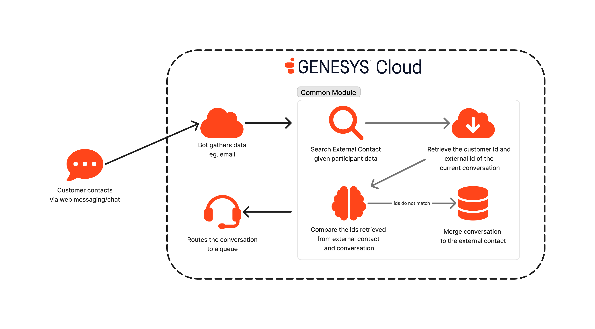

# Merge Ephemeral Message Conversation to an External Contact using Participant Data

This blueprint provides a common module in an Inbound Message Flow that accepts participant data for identifying information like an email address, phone number, etc. and attempt to find an external contact that owns the identity and merge the conversation with that existing record to establish a single customer view.

