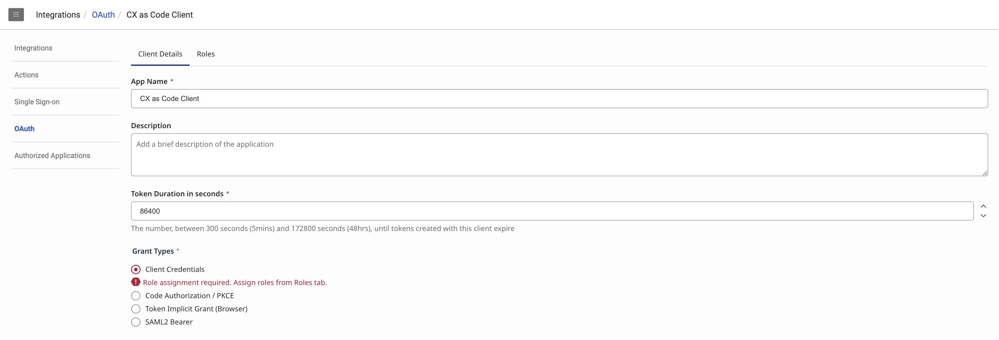
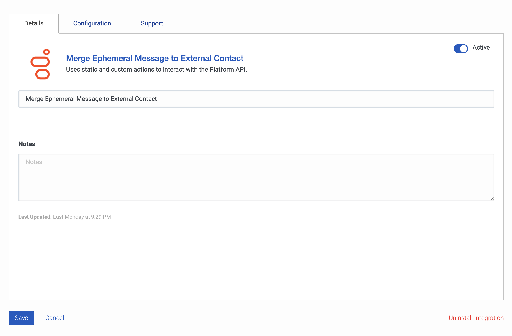
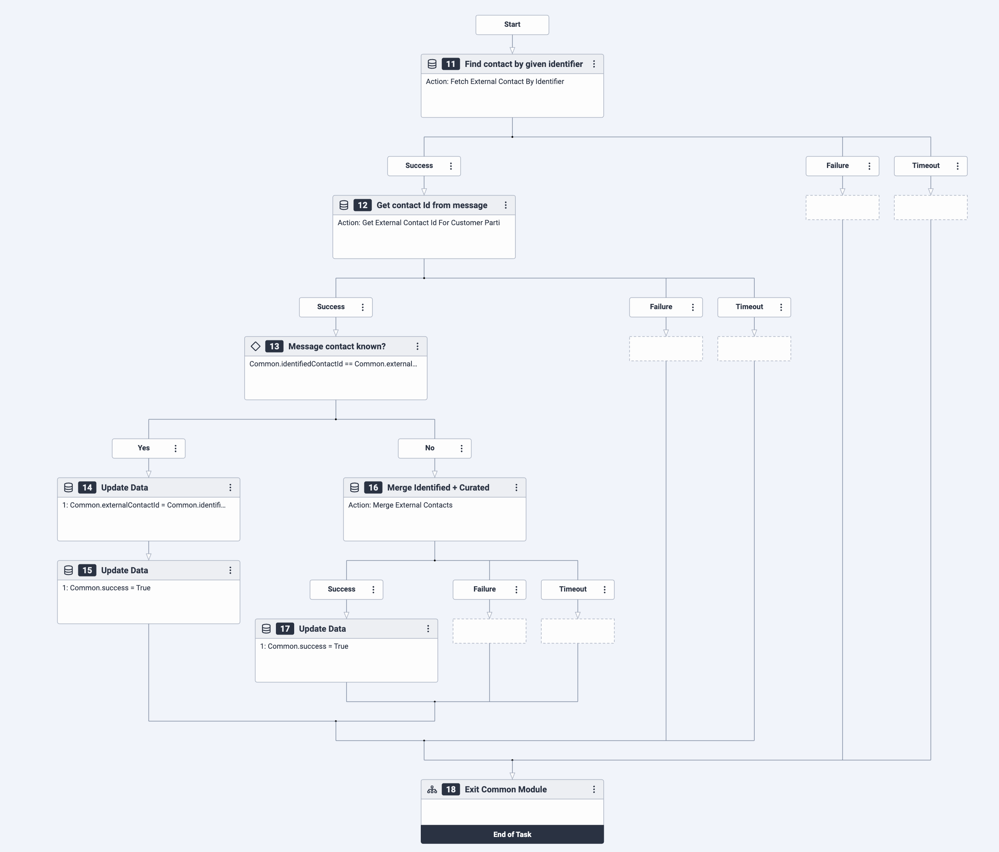

Ephemeral messaging conversations are not currently automatically identified to an existing external contact, which means when they arrive at the Agent they are typically unknown with no customer journey data available. This blueprint provides a common module in an Inbound Message Flow that accepts participant data for identifying information like an email address, phone number, etc. and attempt to find an external contact that owns the identity and merge the conversation with that existing record to establish a single customer view.


## Solution Components

- **Genesys Cloud** - a suite of Genesys cloud services for enterprise-grade communications, collaboration, and contact center management.
- **Genesys Cloud API** - A set of RESTful APIs that enables you to extend and customize your Genesys Cloud environment.
- **Data Action** - Provides the integration point to invoke a third-party REST web service or AWS lambda.
- **Architect flows** - A flow in Architect, a drag and drop web-based design tool, dictates how Genesys Cloud handles inbound or outbound interactions.
- **Web messaging and Messenger** - The Genesys Cloud messaging platform that enables asynchronous conversations and a unified agent and supervisor experience across all Genesys Cloud messaging channels.

## Prerequisites

- Specialized Knowledge
  - Administrator-level knowledge of Genesys Cloud.
  - Basic knowledge of Genesys Cloud Architect.
  - Basic knowledge of the Genesys Cloud API.
- Genesys Account Requirements
  - A Genesys Cloud license (CX 1 Digital or greater). For more information, see [Genesys Cloud Pricing](https://www.genesys.com/pricing "Goes to the Genesys Cloud Pricing page").
  - Master Admin role in Genesys Cloud. For more information, see [Roles and permissions overview](https://help.mypurecloud.com/?p=24360 "Goes to the roles and permissions overview in the Genesys Cloud Resource Center") in the Genesys Cloud Resource Center.
  - [OAuth Client](https://help.mypurecloud.com/articles/create-an-oauth-client/ "Goes to the Create an OAuth Client article") with the Master Admin role.

## Implementation Steps

This blueprint has 2 implementation steps that allows you to do this manually via Genesys Cloud or use CX as Code _(which is highly recommended)_.

- [Preparation Steps](#preparation-steps "Goes to the Preparation Steps section")
    1. [Clone the Repository](#clone-the-repository "Goes to the Clone the Repository section")
    2. [Create an OAuth Client](#create-an-oauth-client "Goes to the Create an OAuth Client section")
- [Manual Implementation via Genesys Cloud](#manual-implementation-via-genesys-cloud "Goes to the Manual Implementation via Genesys Cloud section")
    1. [Add Genesys Cloud Data Action Integration](#add-genesys-cloud-data-action-integration "Goes to the Add Genesys Cloud Data Action Integration section")
    2. [Import the Data Actions](#import-the-data-actions "Goes to the Import the Data Actions section")
    3. [Import and Configure Architect Flows](#import-the-architect-flows "Goes to the Import the Architect Flows section")
    4. [Create Messaging Configuration and Deployment](#create-messaging-configuration-and-deployment "Goes to the Create Messaging Configuration and Deployment section")
- [CX as Code](#cx-as-code "Goes to the CX as Code section")
    1. [Setup environment variables](#setup-environment-variables "Goes to the Setup environment variables section")
    2. [Configure the Terraform build](#configure-the-terraform-build "Goes to the Configure the Terraform build section")
    3. [Run Terraform](#run-terraform "Goes to the Run Terraform section")
- [Deployment and Testing](#deployment-and-testing "Goes to the Deployment and Testing section")

## Preparation Steps

### Clone the Repository

Clone the blueprint repository [merge-ephemeral-message-to-external-contact-blueprint](https://github.com/GenesysCloudBlueprints/merge-ephemeral-message-to-external-contact-blueprint "Goes to the merge-ephemeral-message-to-external-contact-blueprint repository") to your local machine. You can also run this git command to clone the repository:

```bash
git clone https://github.com/GenesysCloudBlueprints/merge-ephemeral-message-to-external-contact-blueprint.git
```

### Create an OAuth Client

In Genesys Cloud Admin, go to **Integrations** > **OAuth**. Then, click **Add Client**.


Provide the **Name**, **Description**, and **Token Duration**. Select the `Client Credentials` **Grant Type**. This will ask you to select role/s for this client, which you can select on the **Roles** tab. Once you have assigned a role and provided the details, click **Save**.




You can then see the Client ID and Client Secret that you will use later.


## Manual Implementation via Genesys Cloud

### Add Genesys Cloud Data Action Integration

Add a Genesys Cloud data action integration for each OAuth client being used with this blueprint to call the Genesys Cloud Public API to:

- Fetch External Contact By Identifier
- Get External Contact Id For Customer Participant
- Merge External Contacts

:::primary
You can also use your existing Genesys Cloud Data Action Integration in order to implement this blueprint.
:::

To create a data action integration in Genesys Cloud:

1. Navigate to **Admin** > **Integrations** > **Integrations** and install the **Genesys Cloud Data Actions** integration. For more information, see [About the data actions integrations](https://help.mypurecloud.com/?p=209478 "Opens the About the data actions integrations article") in the Genesys Cloud Resource Center.

2. Enter a name for the Genesys Cloud Data Action, such as **Merge Ephemeral Message to External Contact** in this blueprint solution.

3. On the **Configuration** tab, click **Credentials** and then click **Configure**.

4. Enter the [client ID and client secret that you created](#create-an-oauth-client "Goes to the Create an OAuth Client section"). Click **OK** and save the data action.

5. Navigate to the Integrations page and set the data action integration to **Active**.



### Import the Data Actions

All Data Actions to import (that are in JSON files) are in the `/exports` folder in the [blueprint repository](#clone-the-repository "Goes to the Clone the Repository section") namely:

- `FetchExternalContactByIdentifierDataAction.json`
- `GetExternalContactIdForCustomerParticipantV2DataAction.json`
- `MergeExternalContactsDataAction.json`

You can import these data actions using the following steps:

1. In Genesys Cloud, navigate to **Admin** > **Integrations** > **Actions** and click **Import**.
2. Select the json files and associate with **Merge Ephemeral Message to External Contact** data action integration.
3. Click **Import Action**.
4. Click **Save & Publish**


### Import the Architect Flows

There are three additional files in the `/exports` folder in the [blueprint repository](#clone-the-repository "Goes to the Clone the Repository section") that contains the flows needed:

1. `ResolveContact.i3CommonModuleFlow` - the common module that utilizes the data actions provided. Given the participant data (ie. email, phone number, social media details, etc.), it calls the `Fetch External Contact By Identifier` data action to fetch an external contact given the provided participant data. It then calls the `Get External Contact Id For Customer Participant` data action to fetch the contact IDs in the current conversation. The module then checks against the ID from the external contact and the ID from the conversation. If it didn't match, the conversation will be merged to the external contact with the `Merge External Contacts` data action.

2. `MergeExternalContactBot.i3BotFlow` - the bot flow that asks for the participant's email. For demonstration purposes, we will be asking the participant's email to retrieve participant data. You may modify the bot flow to accept other participant data like mobile number, social media name, etc.

3. `MergeExternalContactMessageFlow.i3InboundMessage`- the inbound message flow that utilizes both the bot flow and common module. It starts with the bot flow that asks for the participant's email and then proceeds to the common module. Once, completed, it then routes the flow to a queue.

#### Import the Common Module

1. In Genesys Cloud, navigate to **Admin** > **Architect** > **Flows:Common Module** and click **Add**.

2. Enter a name for the inbound message flow and click **Create Flow**.

3. From the **Save** menu, click **Import**.

4. Select the `ResolveContact.i3CommonModuleFlow` file from `/exports` and click **Import**.

5. Ensure that the data actions are connected to the correct integration and data action. You may change these to point to the correct one when there is an error detected.

6. Click **Save** and then click **Publish**.



#### Import the Bot Flow

1. In Genesys Cloud, navigate to **Admin** > **Architect** > **Flows:Bot Flow** and click **Add**.

2. Enter a name for the inbound message flow and click **Create Flow**.

3. From the **Save** menu, click **Import**.

4. Select the `MergeExternalContactBot.i3BotFlow` file from `/exports` and click **Import**.

5. Click **Save** and then click **Publish**.


#### Import the Inbound Message Flow

1. In Genesys Cloud, navigate to **Admin** > **Architect** > **Flows:Inbound Message Flow** and click **Add**.

2. Enter a name for the inbound message flow and click **Create Flow**.

3. From the **Save** menu, click **Import**.

4. Select the `MergeExternalContactMessageFlow.i3InboundMessage` file from `/exports` and click **Import**.

5. Click the `Transfer to ACD` step and select a queue to accept the Inbound Message interaction.

6. Click **Save** and then click **Publish**.

:::primary
**Note**: Ensure that the `Call Bot Flow` and `Call Common Module` step is connected to the correct bot flow and common module.
:::


### Create Messaging Configuration and Deployment

#### Messenger Configuration

1. In Genesys Cloud, navigate to **Admin** > **Message** > **Messenger Configurations** and click **New Configuration**.
2. Fill in the configuration based on your needs.
3. Click **Save New Version**.

#### Messenger Deployment

1. In Genesys Cloud, navigate to **Admin** > **Message** > **Messenger Deployments** and click **New Deployment**.
2. In **Select your Configuration**, select the **Messenger Configuration** you made previously.
3. In **Select your Architect Flow**, select the **Merge Ephemeral Message To External Contact Flow**.
4. Click **Save**.

## CX as Code

### Setup environment variables

In the root directory of the repository, set the following environment variables in a terminal window before you run this project using the Terraform provider:

- `GENESYSCLOUD_OAUTHCLIENT_ID` - This variable is the Genesys Cloud client credential grant Id that CX as Code executes against.
- `GENESYSCLOUD_OAUTHCLIENT_SECRET` - This variable is the Genesys Cloud client credential secret that CX as Code executes against.
- `GENESYSCLOUD_REGION` - This variable is the Genesys Cloud region in your organization.

:::primary
You can also use the [client ID and client secret that you created](#create-an-oauth-client "Goes to the Create an OAuth Client section").
:::

### Configure the Terraform build

In the root directory of the repository, open `dev.auto.tfvars` file, where you need to set the following:

- `email` - The email of the account that will be used to assigned to the given Genesys Cloud queue.
- `division` - The division name where the Genesys Cloud objects will be created.
- `bot_flow_name` - name to be assigned to the bot flow.
- `common_module_name`- name to be assigned to the common module.
- `queue_name` - name of the queue to be created that will be assigned to the inbound message flow.
- `web_deployment_configuration_name` - name to be assigned to the web message configuration.
- `web_deployment_name` - name to be assigned to the web message deployment.
- `client_id` - value of your OAuth Client ID using Client Credentials to be used for the data action integration.
- `client_secret` - value of your OAuth Client secret using Client Credentials to be used for the data action integration.

Do replace the `email`, `division`, `client_id`, and `client_secret`. The file already provided names for the Genesys Cloud objects, which you can also modify.

:::primary
**Important**: Do not commit a change in the `.tfvars` file that involves saving sensitive information.
:::

### Run Terraform

The blueprint solution is now ready for your organization to use.

To run, issue the following commands:

- `terraform init` - This command initializes a working directory containing Terraform configuration files.  
- `terraform plan` - This command executes a trial run against your Genesys Cloud organization and displays a list of all the Genesys Cloud resources Terraform created. Review this list and make sure that you are comfortable with the plan before you continue to the next step.
- `terraform apply --auto-approve` - This command creates and deploys the necessary objects in your Genesys Cloud account. The `--auto-approve` flag provides the required approval before the command creates the objects.

After the `terraform apply --auto-approve` command successfully completes, you can see the output of the command's entire run along with the number of objects that Terraform successfully created. Keep the following points in mind:

- This project assumes that you run this blueprint solution with a local Terraform backing state, which means that the `tfstate` files are created in the same folder where you run the project. Terraform recommends that you use local Terraform backing state files **only** if you run from a desktop or are comfortable deleting files.

- As long as you keep your local Terraform backing state projects, you can tear down this blueprint solution. To tear down the solution, change to the `docs/terraform` folder and issue the  `terraform destroy --auto-approve` command. This command destroys all objects that the local Terraform backing state currently manages.

## Deployment and Testing

### Deploy the messaging snippet to your website

1. In the Genesys Cloud, navigate to **Admin** > **Message** > **Messenger Deployments**. Select your Messenger Deployment.
2. Under **Deploy your snippet**, click **Copy to Clipboard** to copy the snippet. Paste the snippet in the `<head>` tag of the web pages where you want the Messenger to appear.


:::primary
You can also use tools like [Tampermonkey](https://www.tampermonkey.net/ "Goes to the Tampermonkey website"), to integrate the snippet script to your local browser for testing.
:::

### Test the message flow using the Web Chat/Messaging Tool in Genesys Cloud Developer Center

You can also use our tool in the Genesys Cloud Developer Center to test the flow without deploying it to your website or using other tools.

1. Go to the [Web Chat/Messaging Tool Page](https://developer.genesys.cloud/devapps/web-chat-messenger "Goes to the Web Chat/Messaging Tool Page in the Genesys Cloud Developer Center") in the Genesys Cloud Developer Center.
2. Login to an admin account in the organization where you created your Genesys Cloud objects.
3. Go to the **Web messenger** tab > **Deployments**. Then, choose the messenger deployment you just created.
4. Once selected, click **Start Chat**.
5. To test if the flow works, once you have started the chat, the bot will run and will ask for an email. Enter an email that is related to an existing external contact. If you haven't created a test external contact, there's [a guide on how to create an external contact](https://help.mypurecloud.com/articles/add-contact/ "Goes to Add Contact in Genesys Cloud Resource Center").
6. The flow will then proceed to perform the common module. As a blueprint, the flow will send back a response in the chat if the common module made a successful operation. To check if the conversation is merged to the given external contact, go to **Directory** > **External Contacts** and look for the external contact you used. You will then see in **Interactions** list that your recent chat is in there.


## Additional Resources

- [Genesys Cloud API Explorer](https://developer.genesys.cloud/devapps/api-explorer "Goes to the API Explorer in the Genesys Cloud Developer Center")
- [About the Genesys Cloud data actions integration](https://help.mypurecloud.com/articles/about-genesys-cloud-data-actions-integration/ "Goes to the About the Genesys Cloud data actions integration article in the Genesys Cloud Resource Center")
- [Genesys Cloud Architect](https://help.mypurecloud.com/articles/about-architect/ "Goes to the About Architect article in the Genesys Cloud Resource Center")
- [merge-ephemeral-message-to-external-contact-blueprint](https://github.com/GenesysCloudBlueprints/merge-ephemeral-message-to-external-contact-blueprint "Goes to the merge-ephemeral-message-to-external-contact-blueprint repository") repository
